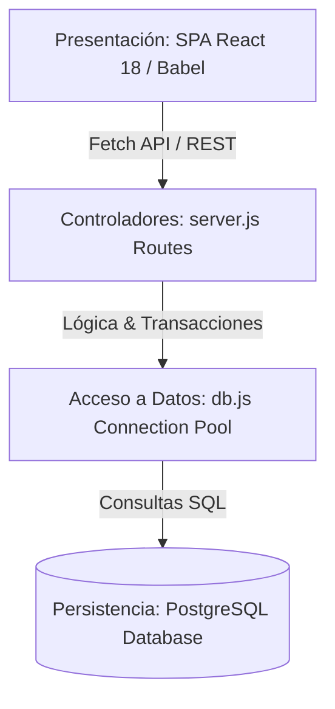
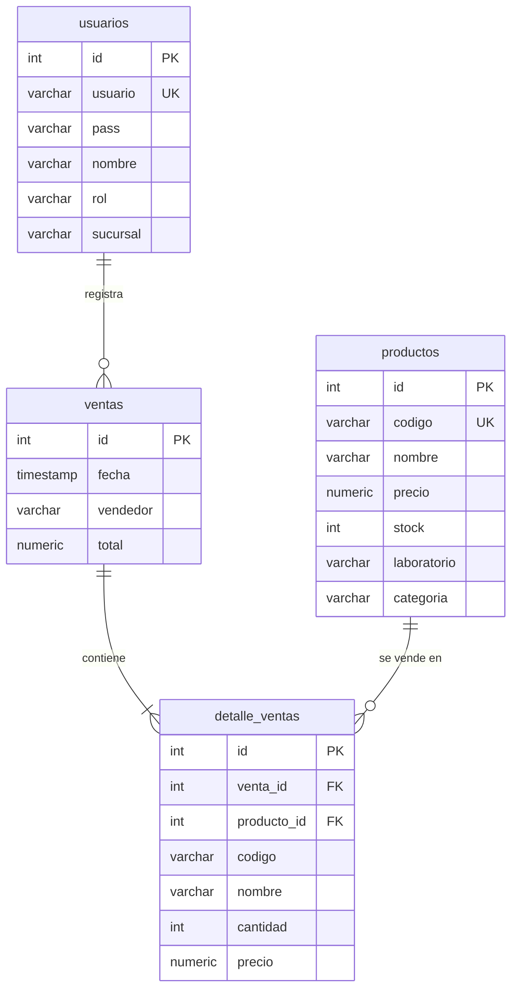

# Informe Técnico de Arquitectura y Calidad de Software — FARMABOL

Este documento detalla el diseño arquitectónico, el modelo de datos, la estrategia de refactorización y los resultados de control de calidad implementados para el sistema de control de inventarios y ventas de **Farmacias Bolivianas Unidas (FARMABOL)**, cumpliendo con los requisitos de evaluación de los **Hitos 3 y 4**.

---

## 1. Justificación del Estilo Arquitectónico

Se ha seleccionado el **Estilo de Arquitectura por Capas (Layered Architecture)**, complementado con un enfoque **MVC (Model-View-Controller)** para estructurar el backend.



### Justificación Técnica frente a Alternativas:
1. **Frente a Microservicios:** FARMABOL cuenta con 12 sucursales nacionales y maneja un volumen transaccional medio. Dividir el sistema en microservicios independientes (ej. servicio de inventario y servicio de ventas separados) introduciría una sobrecarga innecesaria en la comunicación de red, aumentaría la latencia y dificultaría el mantenimiento. Además, requeriría patrones complejos como *Sagas* o *Two-Phase Commit* para mantener la consistencia transaccional del stock de medicamentos, lo cual no se justifica para la escala actual del negocio.
2. **Consistencia de Datos Relacional (ACID):** El control de stock de medicamentos exige atomicidad absoluta. Si un cliente compra tres productos diferentes, la venta no debe registrarse a menos que haya stock disponible para todos los ítems. El estilo por capas con una base de datos relacional monolítica centralizada (PostgreSQL) permite garantizar transacciones ACID atómicas nativas de forma muy simple y robusta.
3. **Mantenibilidad y Separación de Conceptos:** La separación en Capa de Presentación (Frontend React), Capa de Rutas y Lógica de Negocio (Backend Express) y Capa de Datos (PostgreSQL Pool) permite que los desarrolladores trabajen en la interfaz gráfica sin alterar la base de datos, y viceversa.

---

## 2. Modelo de Datos Relacional (PostgreSQL)

La persistencia del sistema está modelada sobre **4 tablas normalizadas** en PostgreSQL 18, garantizando integridad referencial mediante claves primarias (`PRIMARY KEY`), claves foráneas (`FOREIGN KEY`) y restricciones de validación (`CHECK`).



### Diccionario de Datos Breve:
1. **`usuarios`**: Almacena el personal del sistema, con su respectiva sucursal y rol de acceso (`ADMIN` para administración de catálogo, o `VENDEDOR` para consulta de stock e ingresos de caja).
2. **`productos`**: Almacena el catálogo de medicamentos, controlando el stock disponible, laboratorio fabricante, categoría terapéutica y código de barra único.
3. **`ventas`**: Cabecera de la transacción financiera que consolida la hora exacta, el vendedor que la ingresó y el total monetario de la venta.
4. **`detalle_ventas`**: Tabla de ruptura que normaliza la relación de muchos a muchos (N:M) entre ventas y productos, almacenando de forma histórica el código, nombre, precio unitario y cantidad vendida de cada ítem, evitando que cambios futuros en el catálogo alteren los registros contables históricos.

---

## 3. Evidencia de Refactorización (Antes vs. Después)

De acuerdo con las directrices de calidad de software del **Hito 4**, se realizó una refactorización de código en el endpoint crítico de creación de ventas (`POST /api/ventas`) para solucionar dos problemas fundamentales: **falta de atomicidad en base de datos (inconsistencias)** y **condiciones de carrera por concurrencia (venta de stock inexistente)**.

### Código ANTES de Refactorizar (Commit `bfffabb`)
En el diseño inicial, la inserción se realizaba de manera secuencial y no transaccional. Si fallaba el stock a la mitad del carrito, los productos anteriores ya se habían descontado y la cabecera de la venta ya se había creado, dejando la base de datos en un estado inconsistente (stock huérfano). Además, no existía bloqueo de filas, lo que permitía condiciones de carrera bajo ventas simultáneas.

```javascript
// [!] ANTES: Sin transacciones SQL ni bloqueo de filas. Inconsistente y vulnerable a race conditions.
app.post('/api/ventas', async (req, res) => {
  const { items, vendedor } = req.body;
  try {
    let totalVenta = 0;
    for (const it of items) {
      totalVenta += it.cantidad * it.precio;
    }
    const ventaRes = await query('INSERT INTO ventas (vendedor, total) VALUES ($1, $2) RETURNING id', [vendedor, totalVenta]);
    const ventaId = ventaRes.rows[0].id;

    for (const it of items) {
      const prodRes = await query('SELECT id, stock, nombre FROM productos WHERE codigo = $1', [it.codigo]);
      const prod = prodRes.rows[0];

      if (prod.stock < it.cantidad) {
        // ERROR: La cabecera ya se insertó y el stock de otros ítems ya se modificó. ¡Inconsistencia!
        return res.status(400).json({ message: `Stock insuficiente para ${prod.nombre}` });
      }
      const nuevoStock = prod.stock - it.cantidad;
      await query('UPDATE productos SET stock = $1 WHERE id = $2', [nuevoStock, prod.id]);
      await query('INSERT INTO detalle_ventas (venta_id, producto_id, codigo, nombre, cantidad, precio) ...');
    }
    res.status(201).json({ id: ventaId, total: totalVenta });
  } catch (err) {
    res.status(500).json({ message: 'Error', error: err.message });
  }
});
```

### Código DESPUÉS de Refactorizar (Commit `2aa35da`)
En el diseño refactorizado, todo el proceso se ejecuta dentro de un bloque transaccional (`BEGIN`, `COMMIT`, `ROLLBACK`). Se emplea la instrucción **`FOR UPDATE`** de PostgreSQL para bloquear las filas de los productos que se van a vender, impidiendo que otra petición paralela altere el stock durante el transcurso de la validación. Si cualquier producto falla en stock, se ejecuta un `ROLLBACK` total.

```javascript
// [✓] DESPUÉS: Con transacciones ACID, bloqueo concurrente (FOR UPDATE) y validación segura del total.
app.post('/api/ventas', async (req, res) => {
  const { items, vendedor } = req.body;
  if (!items || items.length === 0) return res.status(400).json({ message: 'Sin ítems' });

  const client = await pool.connect();
  try {
    await client.query('BEGIN'); // Iniciar bloque transaccional atómico
    let totalVenta = 0;
    const itemsProcesados = [];

    for (const it of items) {
      // Bloquear la fila del producto para evitar race conditions
      const prodRes = await client.query(
        'SELECT id, stock, nombre, precio FROM productos WHERE codigo = $1 FOR UPDATE',
        [it.codigo]
      );
      if (prodRes.rows.length === 0) throw new Error(`Producto ${it.codigo} no existe.`);

      const prod = prodRes.rows[0];
      if (parseInt(prod.stock) < it.cantidad) {
        throw new Error(`Stock insuficiente para ${prod.nombre}. Disp: ${prod.stock}`);
      }

      const precioReal = parseFloat(prod.precio);
      totalVenta += it.cantidad * precioReal;

      itemsProcesados.push({
        id: prod.id, codigo: it.codigo, nombre: prod.nombre,
        cantidad: it.cantidad, precio: precioReal
      });
    }

    const ventaRes = await client.query('INSERT INTO ventas (vendedor, total) VALUES ($1, $2) RETURNING id', [vendedor, totalVenta]);
    const ventaId = ventaRes.rows[0].id;

    for (const it of itemsProcesados) {
      await client.query('UPDATE productos SET stock = stock - $1 WHERE id = $2', [it.cantidad, it.id]);
      await client.query(
        'INSERT INTO detalle_ventas (venta_id, producto_id, codigo, nombre, cantidad, precio) VALUES ($1, $2, $3, $4, $5, $6)',
        [ventaId, it.id, it.codigo, it.nombre, it.cantidad, it.precio]
      );
    }

    await client.query('COMMIT'); // Confirmar todos los cambios si todo salió bien
    res.status(201).json({ id: ventaId, total: totalVenta });
  } catch (err) {
    await client.query('ROLLBACK'); // Abortar y revertir todo si ocurre un error
    res.status(400).json({ message: err.message });
  } finally {
    client.release(); // Devolver el cliente al Pool de conexiones
  }
});
```

---

## 4. Análisis de Calidad Estática (ESLint)

Para asegurar la adherencia a buenas prácticas de JavaScript y evitar errores en tiempo de ejecución, se integró **ESLint 9** en el flujo de desarrollo del proyecto.

### Configuración de ESLint (`eslint.config.js`):
Se configuró un archivo de configuración plano (Flat Config) para definir las variables globales del entorno del navegador (React, ReactDOM) y de Node.js de forma controlada.

### Ejemplo de Error de Calidad Resuelto:
Al ejecutar el linter (`npm run lint`), la herramienta detectó una advertencia de variable no definida crítica en el backend (`server.js`):
```text
C:\Users\Artemis\Desktop\atermis laptop\software II\evaluacion h4\FARMABOL\server.js
  181:24  warning  'pool' is not defined  no-undef
```
**Causa:** Se estaba llamando a `pool.connect()` para la transacción SQL en `server.js` pero no se había importado la constante `pool` desde `db.js`.
**Resolución:** Se corrigió inmediatamente la importación en la línea 6 de `server.js` a `import pool, { initDatabase, query } from './db.js';`.
Posteriormente, una nueva ejecución del análisis estático arrojó **0 errores y 0 advertencias**, garantizando un código de producción limpio.

---

## 5. Guía de Despliegue en la Nube

Para llevar el sistema FARMABOL a producción en una infraestructura gratuita, se recomienda la siguiente combinación de plataformas PaaS/SaaS:

### 1. Base de Datos: Supabase (PostgreSQL gestionado)
1. Regístrate en [Supabase](https://supabase.com/).
2. Crea un nuevo proyecto y obtén la cadena de conexión URI de la base de datos (Transaction Connection String).
3. Habilita las variables de entorno de conexión en tu servidor de despliegue.

### 2. Backend API: Render / Railway
1. Sube tu repositorio de GitHub a tu cuenta.
2. Crea un nuevo **Web Service** en Render.
3. En la sección **Environment**, agrega las siguientes variables de entorno:
   - `PGHOST` (Tu host de base de datos de Supabase)
   - `PGPORT` (`5432` o `6543`)
   - `PGUSER` (`postgres`)
   - `PGPASSWORD` (Tu contraseña de Supabase)
   - `PGDATABASE` (`postgres` o tu base de datos)
   - `PORT` (`3000`)
4. Define el comando de inicio como `npm start`. El script inicializará y sembrará la base de datos Supabase automáticamente al arrancar.

### 3. Frontend Estático: Vercel / Netlify
1. Dado que el frontend está acoplado como archivos estáticos servidos por Express en Render, **puedes acceder al frontend directamente en la URL pública que genera Render** (ej: `https://farmabol.onrender.com/`). Esto simplifica el despliegue a un único servicio en la nube que gestiona todo de forma unificada.
